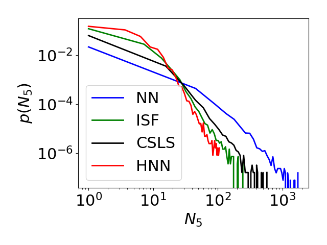

- [HNN](#HNN)
- [Prerequisites](#Prerequisites)
- [Experiments](#Experiments)

# HNN
This repositorty contains the code to reproduce all results from the paper:

Jiaji Huang, Qiang Qiu and Kenneth Church. Hubless Nearest Neighbor Search for Bilingual Lexicon Induction. ACL 2019

Neareast Neighbor (NN) Search is widely applied in retrieval tasks. However, a phenomenon called hubness [[1]](http://www.jmlr.org/papers/volume11/radovanovic10a/radovanovic10a.pdf) often degrades NN's performance.
Hubness appears as some data points, called hubs, being suspiciously close to many others. It is often encountered in high dimensional spaces.

This work is interested in reducing hubness during retrieval. The proposed is a new method, which we call Hubless Nearest Neighbor (HNN) Search.
Theoretically, HNN provides a unified view towards NN and Inverted SoFtmax (ISF [[2]](https://arxiv.org/pdf/1702.03859.pdf)), a recently proposed retrieval method that mitigates hubness.
Empirically, HNN demonstrates superior accuracy in a typical retrieval task, Bilingual Lexicon Induction (BLI [[3]](https://arxiv.org/pdf/1710.04087.pdf)).

If you have any question, please post it on github or email at authentichj@outlook.com

# Prerequisites
Environment
* python (3.6.6)

Mandatory Packages
* numpy (1.15.4)

* scipy (1.1.0)

* matplotlib (3.0.2)

* gensim (3.6.0)

All of the above can be installed via `pip`, e.g.,
```
pip install 'numpy==1.15.4'
```

Optional Packages (if use GPU)
* cupy-cuda90

Assume cuda available version is 9.0. Install it by
```
pip install cupy-cuda90
```
Also, append the CUDA paths in bash environment. The following is a working example:
```
CUDA_PATH=/path/to/cuda-9.0.176
CUDNN_PATH=/path/to/cudnn-9.0-linux-x64-v7.0-rc
export LD_LIBRARY_PATH=$CUDA_PATH/lib64:$CUDA_PATH/extras/CUPTI/lib64:$CUDNN_PATH/lib64:$LD_LIBRARY_PATH
export PATH=$CUDA_PATH/bin:$PATH
```
Note: Newer versions of Python and the above packages are not tested, but there is no reason why they should not work. So feel free to play with newer versions.

# Experiments
## Synthetic Data
Run
```
python GMM_retrieval.py
```
to see the synthetic data example in section 5.1 of the paper. The task is simply to retrieve the same class from a Gaussian mixture. The purpose of this experiment is to understand the connection between HNN and other related methods. An examplar output is already given in `./exp/GMM_retrieval.example.log`.

## Bilingual Lexicon Induction
The following will reproduce Table 3 of the paper.

First, download the fasttext embeddings and dictionaries.
```
./get_data.sh
```
Second, run
```
./bli_exp.sh
```
to get induction accuracies. The experiment follows the "supervised" setup at [MUSE](https://github.com/facebookresearch/MUSE), but differs in that we use larger test dictionaries (data/src-tgt.txt). The outputs are logs (`src-tgt.method.log`) and translated words (`src-tgt.method.trans`) stored under `./exp/bli_500K`, where 500K is the vocabulary size for both source and target languages. In supplementary material, We have also reported results of using a vocabulary of 200K. To reproduce that, simply change `V=200000` in `bli_exp.sh`.

After the jobs are done, we can check how hubness is reduced. For example, to check the hubness for Portuguese-to-English task, simply run
```
python hubness_in_translations.py pt en -k 5 -N 200
```
It will produce `k-occurrence` (k=5 in this case) histograms, as measures of hubness, for the different methods. In particular, long tail of the histogram indicates strong hubness, which should be reduced. The Portuguese to English example will have the following histograms, where HNN has the shortest tail, *i.e.*, weakest hubness.
<p align="center">
    
</p>
We will also see some "hubby" words being listed, for example:


| "hubby" words |   NN  | ISF | CSLS | HNN |
|:-------------:|:-----:|:---:|:----:|:---:|
|   conspersus  | 1,776 |   0 |  374 |   0 |
|      s+bd     |   912 |   7 |  278 |  16 |
|      were     |   798 |  99 |  262 |  24 |
|      you      |   474 |  12 |   57 |  20 |

The numerics are the number of times these words being retrieved. A big value indicates that the word is a hub. Note how the values are reduced by HNN.

[[1]](http://www.jmlr.org/papers/volume11/radovanovic10a/radovanovic10a.pdf) Milos Radovanovic, Alexandros Nanopoulos, and Mirjana Ivanovic. 2010. Hubs in space: Popular nearest neighbors in high-dimensional data. Journal of Machine Learning Research.

[[2]](https://arxiv.org/pdf/1702.03859.pdf) Samuel L. Smith, David H. P. Turban, Steven Hamblin, and Nils Y. Hammerla. 2017. Offline bilingual word vectors, orthogonal transformations and the inverted softmax. In International Conference on Learning Representations.

[[3]](https://arxiv.org/pdf/1710.04087.pdf) Alexis Conneau, Guillaume Lample, Marc' Aurelio Ranzato, Ludovic Denoyer, and Hervé Jégou. 2018. Word translation without parallel data. In International Conference on Learning Representations.
